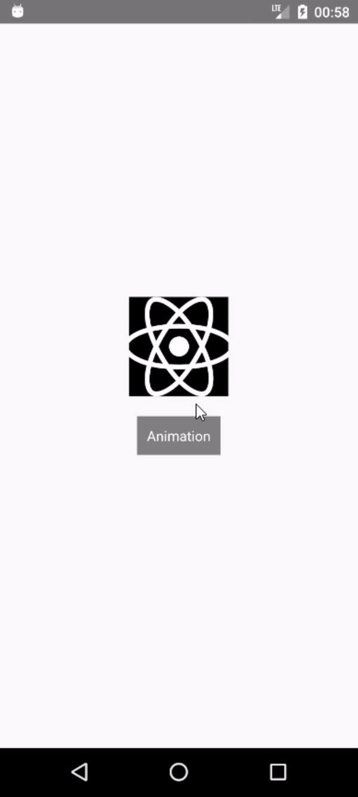

El 12 de marzo de 2019, la comunidad React dio la bienvenida a la versión 59.0 de React Native que trajo el soporte de React Hooks en el desarrollo nativo. 
El lanzamiento de esta versión proporcionó una gran cantidad de recursos impresionantes que parecen ser bien aceptados por la comunidad y, en consecuencia, crean una nueva forma de hacer las cosas. 

Con estos cambios significativos, los desarrolladores que solían implementar los componentes en formas antiguas (como clases con estado), ahora tienen una opción más declarativa y concisa con hooks. 
UseState y useEffect son los más importantes entre los ganchos básicos y adicionales, que se ocupan de los estados y el ciclo de vida de un componente de React. 


Sin embargo, una de las ventajas más poderosas de los ganchos es la capacidad de crear sus propios ganchos personalizados. 
Tal como describe la documentación, la creación de sus propios Hooks le permite extraer la lógica de los componentes en funciones reutilizables, manteniendo un código limpio y plano. 
El objetivo principal de este artículo es mostrar cómo crear un gancho personalizado que se pueda utilizar en todas las animaciones básicas de su proyecto React Native; 

Para ilustrar el gancho de animación, creemos un cuadrado animado simple que cambia su tamaño con solo presionar un botón. 
En el archivo App.js del proyecto creamos un botón simple e importamos el AnimatedComponent que será el cuadrado, como a continuación.

```javascript
const App = () => {
  const [doAnimation, setDoAnimation] = useState(false);
  return (
    <View style={{     
      flex: 1,
      justifyContent: 'center',
      alignItems: 'center',
    }}>
      <AnimatedComponent doAnimation={doAnimation} />
      <TouchableOpacity 
        style={{ 
          margin: 20, 
          backgroundColor: `gray`,
          padding: 10,
        }} 
        onPress={() => setDoAnimation(!doAnimation)}
      >
        <Text style={{color: `white`}}>Animation</Text>
      </TouchableOpacity>
    </View>
  )
};

export default App;
```


El estado doAnimation, como su nombre lo dice, es responsable de ejecutar una nueva animación y se pasa como un accesorio al AnimatedComponent. En React, es un hecho que cada cambio en los accesorios de un componente hace que el componente se renderice nuevamente y con esto, podemos ocuparnos del proceso de animación en el ciclo de vida del componente con el gancho. 

En AnimatedComponent, como se muestra a continuación, importamos el gancho useAnimation y su retorno es un objeto animado que podemos interpolar a nuevos valores en el ancho y alto de la vista cuadrada.


```javascript
import { useAnimation } from './hook';

const AnimatedComponent = ({ doAnimation }) => {
  const animation = useAnimation({ doAnimation, duration: 1000 });
  return (
    //Animated square
    <Animated.View style={{
      width: animation.interpolate({
        inputRange: [0, 1],
        outputRange: [50, 100],
      }),
      height: animation.interpolate({
        inputRange: [0, 1],
        outputRange: [50, 100],
      }),
      backgroundColor: `red`
    }} /> 
  )
}

export default AnimatedComponent;
```


Los ganchos personalizados en sí, solo use los ganchos básicos (solo preste atención a las reglas de los ganchos). Aquí, useEffect ejecuta la función de flecha interna cada vez que cambia la propiedad doAnimation, cronometrando el valor de 0 a 1.
```javascript
import { Animated } from 'react-native';
import { useState, useEffect } from 'react';

export const useAnimation = ({ doAnimation, duration }) => {
  const [animation, setAnimation] = useState(new Animated.Value(0));
  
  useEffect(() => {
    Animated.timing(animation, {
      toValue: doAnimation ? 1 : 0,
      duration,
    }).start();
  }, [doAnimation]);

  return animation;
}
```

El resultado se muestra a continuación.

